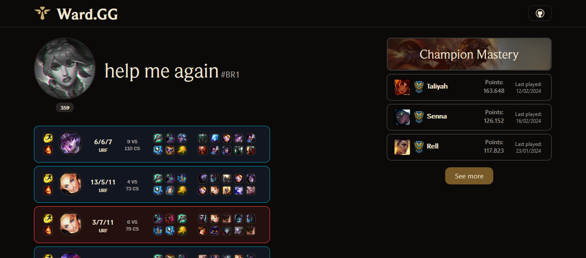

<div align="center">
  <h3> 🌐 
    <a href="https://github.com/felipecomarques/ward-gg/blob/main/README.md" target="_blank">English</a> | 
    <a href="https://github.com/felipecomarques/ward-gg/blob/main/docs/README.pt-br.md" target="_blank">Português</a>  
  </h3>
</div>

# Ward.GG

<div align="left">
    
</div>
Frontend application that displays League of Legends match history and statistics.



## 💻 Overview
The application, known as Ward.GG, is a platform targeted towards the League of Legends gaming community, which utilizes Riot Games API to extract and present relevant information about players performance and match landscape. Within this platform, users have the opportunity to access a variety of individualized statistics, including win rate, KDA (Kills, Deaths, Assists) score, and a detailed match history. The development of the application is based on React and the Shadcn/ui library, aiming to provide a modern and intuitive experience. Ward.GG offers a user-friendly tool designed to assist League of Legends players in understanding and enhancing their in-game performance.

### 💿 Technologies


## ⏬ Installation
    
To run this project locally, please follow these steps:
1. Clone the repository:
```bash
git clone <repository-url>
```

2. Navigate to the project directory:
```bash
cd <project-directory>
```

3. Install dependencies:
```bash
npm install
```

4. Start the development server: 
```bash
npm run dev
```

5. Create a .env file in the root directory of the project (you can use the [exemple](https://github.com/felipecomarques/ward-gg/blob/main/.env.exemple) in the root folder). **The use of an [API key](https://developer.riotgames.com/) is required** :
```
REACT_APP_API_KEY=<your-api-key-here>
```

## 👨‍💻 Developers
This project is a collaborative effort of the following developers:

<table>
  <tr>
    <td>
      <a href="https://github.com/felipecomarques" target="_blank">
        
        <p align="center">Felipe<br/> Marques </p>
      </a>
    </td>
    <td>
      <a href="https://github.com/RayanneOlivera" target="_blank">
        
        <p align="center">Rayanne <br/>Oliveira</p>
      </a>
    </td>
  </tr>
</table>


## ⚖️ License
Code released under the [MIT LICENSE](https://github.com/felipecomarques/ward-gg/blob/main/LICENSE).