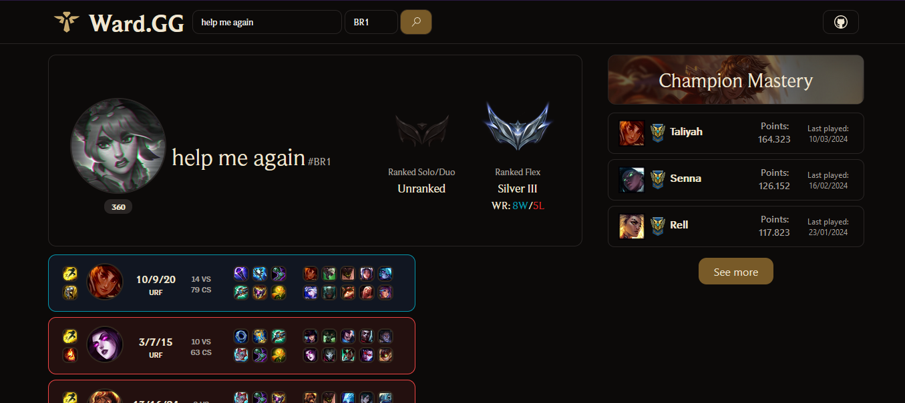

<div align="center">
  <h3> 🌐 
    <a href="https://github.com/felipecomarques/ward-gg/blob/main/README.md" target="_blank">English</a> | 
    <a href="https://github.com/felipecomarques/ward-gg/blob/main/docs/README.pt-br.md" target="_blank">Português</a>  
  </h3>
</div>

# Ward.GG

<div align="left">
    
</div>
Aplicação de frontend que exibe o histórico e estatísticas de partidas do League of Legends.



## 💻 Visão Geral
Ward.GG é uma plataforma direcionada para a comunidade de jogadores de League of Legends, que se utiliza da API da Riot Games para extrair e apresentar informações relevantes sobre o desempenho dos jogadores e o panorama das partidas. Nessa plataforma, os usuários têm a oportunidade de acessar uma variedade de estatísticas individualizadas, incluindo taxa de vitória, pontuação de KDA (Kills, Deaths, Assists) e um detalhado histórico de partidas. O desenvolvimento da aplicação está fundamentado no React e na biblioteca Shadcn/ui , com a finalidade de proporcionar uma experiência moderna e intuitiva. Ward.GG oferece uma ferramenta amigável, destinada a auxiliar os jogadores de League of Legends na compreensão e aprimoramento de seu desempenho dentro do jogo.

### 💿 Tecnologias


## ⏬ Instalação
    
Para rodar este projeto localmente, siga os seguintes passos:
1. Clone o repositório:
```bash
git clone <repository-url>
```

2. Navegue até o diretório do projeto:
```bash
cd <project-directory>
```

3. Instale as dependências:
```bash
npm install
```

4. Inicie o servidor de desenvolvimento: 
```bash
npm run dev
```

5. Crie um arquivo .env no diretório do projeto (você pode usar o [exemplo](https://github.com/felipecomarques/ward-gg/blob/main/.env.exemple) que está na raiz do projeto). **O uso de uma [API Key](https://developer.riotgames.com/) é obrigatório** :
```
REACT_APP_API_KEY=<your-api-key-here>
```
## 👨‍💻 Desenvolvedores
Este projeto é um esforço colaborativo dos seguintes desenvolvedores:

<table>
  <tr>
    <td>
      <a href="https://github.com/felipecomarques" target="_blank">
        
        <p align="center">Felipe<br/> Marques </p>
      </a>
    </td>
    <td>
      <a href="https://github.com/RayanneOlivera" target="_blank">
        
        <p align="center">Rayanne <br/>Oliveira</p>
      </a>
    </td>
  </tr>
</table>


## ⚖️ Licença
Código liberado sob a [LICENÇA MIT](https://github.com/felipecomarques/ward-gg/blob/main/LICENSE).